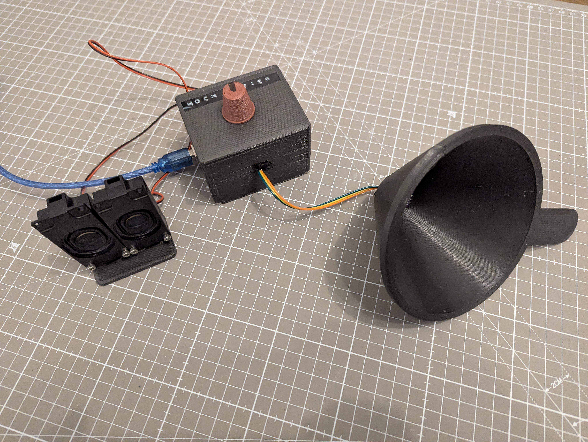

# Voice Pitcher

This Project implements an Arduino Uno based voice pitcher with mic input and speaker output.

The core parts are listed in the BOM folder. All other parts are things i had lying around:
- BC337-40 NPN Transistor for the speaker driver
- 1N4001 Freewheeling Diode for the speaker driver
- some random capacitors for filtering the supply and potentiometer output
- The screws used are M3 maschine screws

